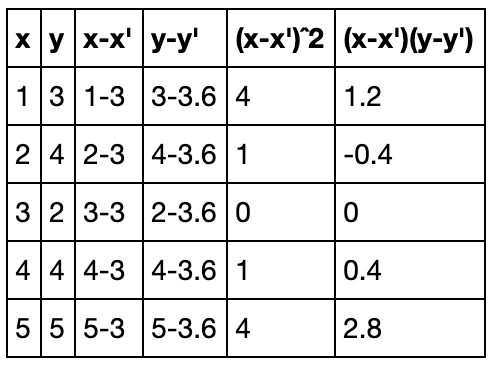

# Predicting Brain Weight Based on Head Size Using Linear Regression.

## How to Get Dataset

The dataset was available on [kaggle compettion - head brain](https://www.kaggle.com/jemishdonda/headbrain).

## What is Regression?

_Regression is a form of predictive modelling technique which investigates the relationship between a dependent and independent variable_

## Undestanding Linear Regression

<p align="center"></p> 
<h6 align="center">Example of how work linear regression algorithm step by step.</h6>


## Getting Started

### Prerequisites

What things you need to undertand this repository

```
 Good knowledgment in Linear Regression, and know how to use Node.js server using command-line interpreter.
```

### Installing

After dowload [Node.js](https://nodejs.org/en/) you need to iniatialize new Node.js project in your terminal:   

```
    npm init -y
```

The next step is install some librarys:

```
    npm install csvtojson ml-regression --save
```

## Usage

To run the regression algorithm, you need to open your terminal and type the following command:

```
 node app.js
```

#

<p align="center"><b>Sincerely:</b> <a href="https://github.com/neemiasbsilva">Neemias B. da Silva</a></p>

#